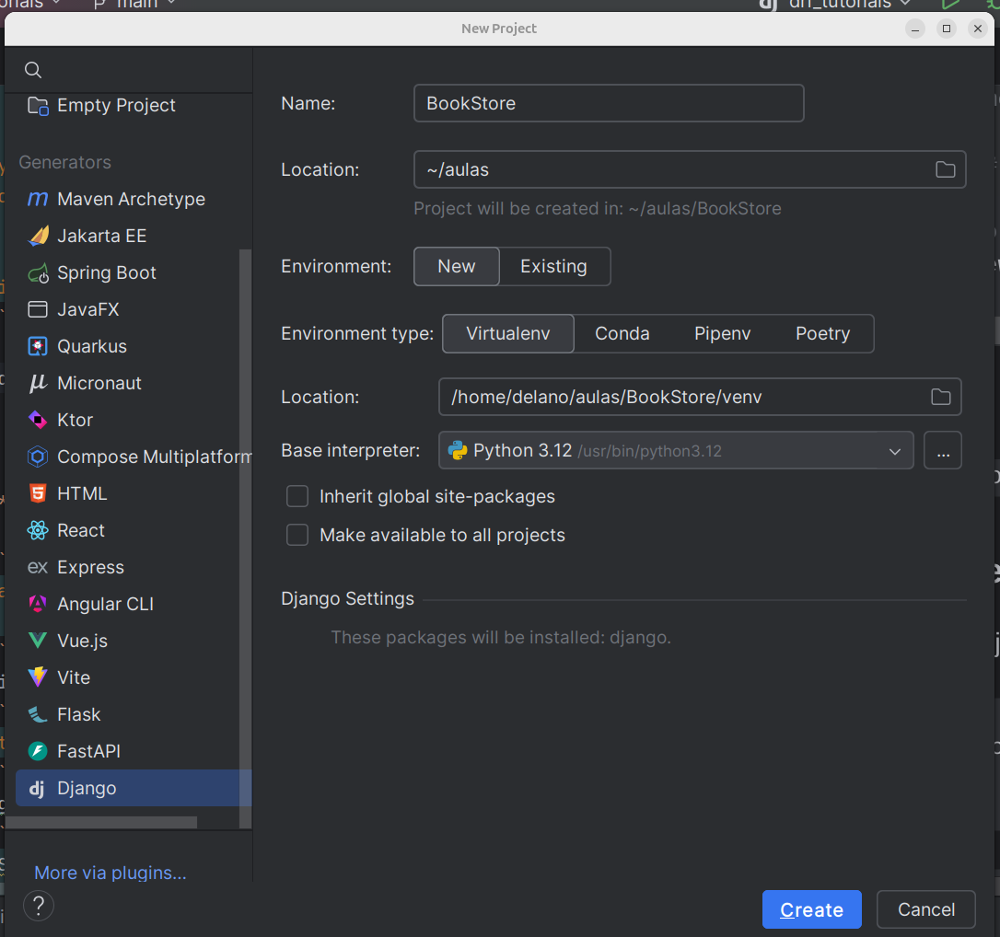

# **Introdução à Arquitetura Frontend-Backend e ao Django Rest Framework**

## **1. O que é Frontend e Backend?**

Imagine que um site ou aplicativo é como um restaurante:
- **Frontend** é o que você vê — o menu, as mesas, o garçom atendendo. É a "cara" do sistema.
- **Backend** é o que acontece na cozinha — o preparo dos pratos, os ingredientes sendo armazenados. É onde os dados e as regras de negócio vivem.

Nos nossos projetos:
- O **Frontend** (a interface que o usuário vê) pode ser feito em várias tecnologias (como HTML, CSS, JavaScript).
- O **Backend** (o servidor) vai processar pedidos e devolver respostas, e é aqui que entra o Django.

---

## **2. O que é REST?**

REST é como um conjunto de regras que ajuda o "garçom" (o backend) a entender e atender os pedidos do cliente (o frontend).
- Ele usa **URLs** como "endereços" para os recursos.
- Os "recursos" são dados que queremos acessar, como uma lista de livros.
- Ele funciona com os métodos HTTP:
    - **GET**: Buscar informações (exemplo: lista de livros).
    - **POST**: Criar algo novo (exemplo: adicionar um livro).
    - **PUT/PATCH**: Atualizar algo.
    - **DELETE**: Apagar algo.

---

## **3. O que é JSON?**

Quando o backend responde para o frontend, ele usa uma "língua universal" chamada **JSON** (JavaScript Object Notation).
- É uma forma simples de organizar e transmitir dados.
- Exemplo de JSON para um livro:

```json
{
  "title": "Aprendendo Django",
  "author": "Maria Silva",
  "price": 29.99
}
```

---

## **4. Passo a Passo: Criando uma API com Django e DRF**

0. Vamos configurar uma ambiente e aplicação Django

0.1. _Usando terminal do Linux ou o powershell do Windows_
   ```bash
   # Create the project directory
    mkdir bookstore
    cd bookstore
    
    # Create a virtual environment to isolate our package dependencies locally
    python3 -m venv venv
    source venv/bin/activate  # On Windows use `env\Scripts\activate`
    
    cd ..
    
    # Install Django and Django REST framework into the virtual environment
    pip install djangorestframework
    django-admin startproject bookstore bookstore/
    cd bookstore
   ```
Agora você pode abrir esse projeto em qualquer IDE.

0.2. _Usando IntelliJ ou PyCharm_


Depois de criar o projeto com IntelliJ ainda é necessário instalar o django rest framework. Abra o terminal dentro do projeto do IntelliJ e execute o seguinte:
```bash
pip install djangorestframework
```

**Para testar se o Django está instalado e pode rodar corretamente, execute:**
```bash
   python3 manage.py runserver
   ```
Acesse o link que ele exibe: http://127.0.0.1:8000/

Vamos criar juntos a aplicação `bookapi`. Siga os passos abaixo.

### **4.1 Configurando o Projeto Django**
1. Crie um app chamado `bookapi`:
   ```bash
   python manage.py startapp bookapi
   ```
2. Registre o app no arquivo `settings.py`:
   ```python
   INSTALLED_APPS = [
       ...
       'bookapi',
       'rest_framework',  # DRF
   ]
   ```

---

### **4.2 Criando o Modelo (Database)**

1. No arquivo `models.py` do app `bookapi`, defina o modelo `Book`:
   ```python
   from django.db import models

   class Book(models.Model):
       title = models.CharField(max_length=255)
       author = models.CharField(max_length=255)
       price = models.FloatField()

       def __str__(self):
           return self.title
   ```

2. Rode as migrações para criar a tabela no banco de dados:
   ```bash
   python manage.py makemigrations
   python manage.py migrate
   ```

---

### **4.3 Criando o Serializer**

No arquivo `serializers.py`, crie um serializer para converter o modelo `Book` para JSON:
```python
from rest_framework import serializers
from bookapi.models import Book

class BookSerializer(serializers.ModelSerializer):
    class Meta:
        model = Book
        fields = '__all__'
```

---

### **4.4 Criando a View**

No arquivo `views.py`, crie uma view para listar e criar livros:
```python
from rest_framework.decorators import api_view
from rest_framework.response import Response
from rest_framework import status
from bookapi.models import Book
from bookapi.serializers import BookSerializer

@api_view(['GET', 'POST'])
def book_list(request):
    if request.method == 'GET':
        books = Book.objects.all()
        serializer = BookSerializer(books, many=True)
        return Response(serializer.data)
    elif request.method == 'POST':
        serializer = BookSerializer(data=request.data)
        if serializer.is_valid():
            serializer.save()
            return Response(serializer.data, status=status.HTTP_201_CREATED)
        return Response(serializer.errors, status=status.HTTP_400_BAD_REQUEST)
```

---

### **4.5 Criando as URLs**

No arquivo `urls.py` do projeto, registre a URL da API:
```python
from django.contrib import admin
from django.urls import path
from bookapi import views

urlpatterns = [
    path('admin/', admin.site.urls),
    path('api/books/', views.book_list),
]
```

---

### **4.6 Testando a API**

1. Rode o servidor:
   ```bash
   python manage.py runserver
   ```
2. Acesse a URL:
    - Para listar os livros: `http://127.0.0.1:8000/api/books/` (use **GET**).
    - Para adicionar um livro: `http://127.0.0.1:8000/api/books/` (use **POST** com um JSON como este):
      ```json
      {
        "title": "O Senhor dos Anéis",
        "author": "J.R.R. Tolkien",
        "price": 49.90
      }
      ```

---

## **5. Desafio para os Alunos**

- Crie uma view e serializer para ver um único objeto editar e deletar livros (usando métodos **PUT** e **DELETE**).
